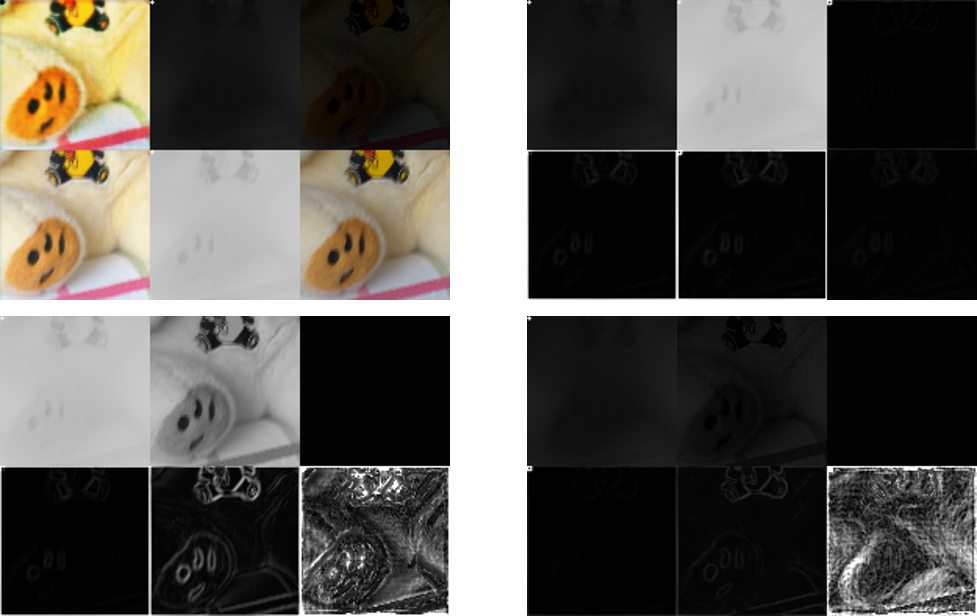
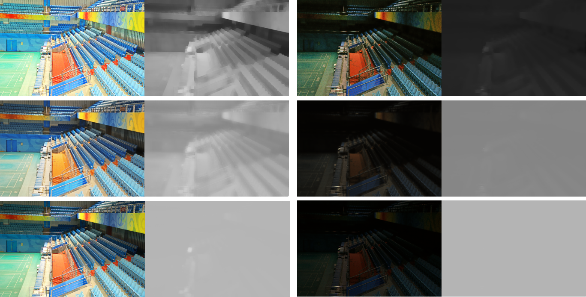

# KinD-pytorch
This is a PyTorch implementation of KinD.  

The official KinD project(TensorFlow) is [KinD](https://github.com/zhangyhuaee/KinD). 

The KinD net was proposed in the following [Paper](http://doi.acm.org/10.1145/3343031.3350926).

Kindling the Darkness: a Practical Low-light Image Enhancer. In ACM MM 2019<br>
Yonghua Zhang, Jiawan Zhang, Xiaojie Guo
****  

## Enviroment ##
1. Python = 3.6
2. PyTorch = 1.2.0
3. Other common packages

## Test ##
Please put test images into './images/inputs' folder and download the pre-trained checkpoints from [BaiduNetDisk](https://pan.baidu.com/s/1e_P6_qxQqAwDG7q6NN_2ng), 提取码：fxkl, then just run
```shell
python test_your_picture.py
# -i: change input path, -o: change output path, -p: Plot more information
# -c: change checkpoints path, -b: change default target brightness
```

## Train ##
The original LOLdataset can be downloaded from [here](https://daooshee.github.io/BMVC2018website/).  
For training, **please change the dataset path in the code**, then run  
```shell
python decom_trainer.py
python illum_trainer.py
python restore_trainer.py
```
You can also evaluate on the LOLdataset, **please change the dataset path in the code**, then run
```shell
python evaluate_LOLdataset.py
```

## Problems ##
I meet some serious problems when I try to train the decomposition net, which makes results look unpleasant.  

### My PyTorch implementation's evaluation on LOLDataset: ###
  
The problem that confuses me the most is the illumination_smoothness_loss. As long as I add this loss, my illuminance map output will tend to be completely black (low light map) and close to gray (high light map).  

### My PyTorch implementation's failure case on LOLDataset: ###
  
I have run the official TensorFlow code to train and test the decompostion net. The result is pretty strange. If I load official checkpoints to test it, it will perform well. However, if I use LOLDataset to train it, it will be worse and worse. I am really puzzled about this issue. If you have any idea about it, please tell me.  

I show the example below.  
### Official implementation's strange case on LOLDataset: ###
  
The left column shows the decomposition results of the high light map, and the right column shows the decomposition results of the low light map. The left side of each image is a reflection map, and the right side is a illumination map. The first line is the effect of the official weight, the second line is the effect when the official code is retrained by 100 epoch, and the third line is the result of the official code training of 1600 epoch. The training code cannot achieve the effect of official weights.

Other test results on LOLDataset(eval15) can be found at the samples-KinD in the [BaiduNetDisk](https://pan.baidu.com/s/1e_P6_qxQqAwDG7q6NN_2ng), 提取码：fxkl.

## References ##
[1] Y. Zhang, J. Zhang, and X. Guo, “Kindling the darkness: A practical low-light image enhancer,” in ACM MM, 2019, pp. 1632–1640. 
